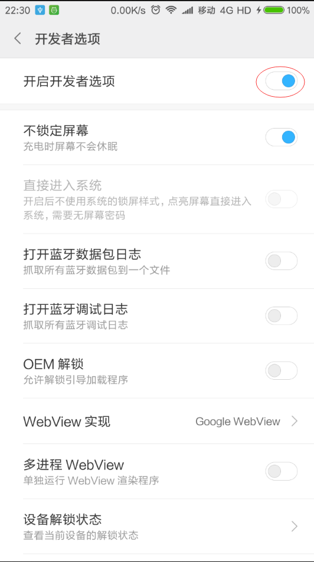
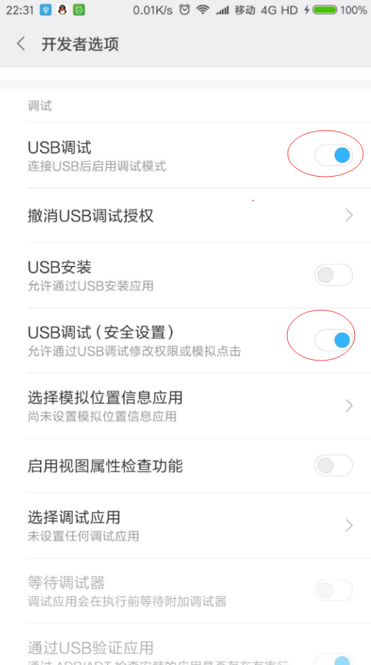

## MFC版微信跳一跳小游戏辅助程序 (VS2017开发)

只需要拷贝出`Release目录下的WheatJump.exe`和`Release下的data目录`到同一个目录下,就能运行本程序. **`只支持安卓`**

1. 先打开手机开发者模式.不同手机打开方式不一样自己百度

2. 用手机数据线连接电脑

3 .开启开发者选项 

4. 开启USB调试(`注意:有两项`) 

5. 打开WheatJump.exe点击`同步微信图片`

6. 然后鼠标左键点击要跳到地方即可.`也可以用鼠标右键点击跳的起始点,默认会自动寻找起始点`

7. 不停的重复第五步,就`OK`

## 更新

1. 使用双缓冲绘图,避免闪烁

2. 修复显示坐标文字的时候.可能导致程序崩溃

